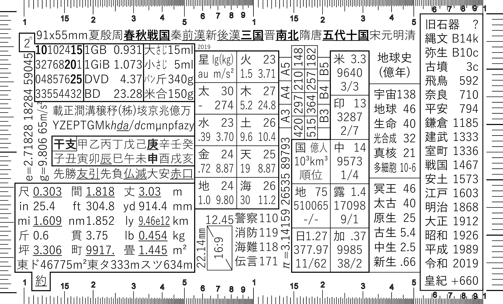
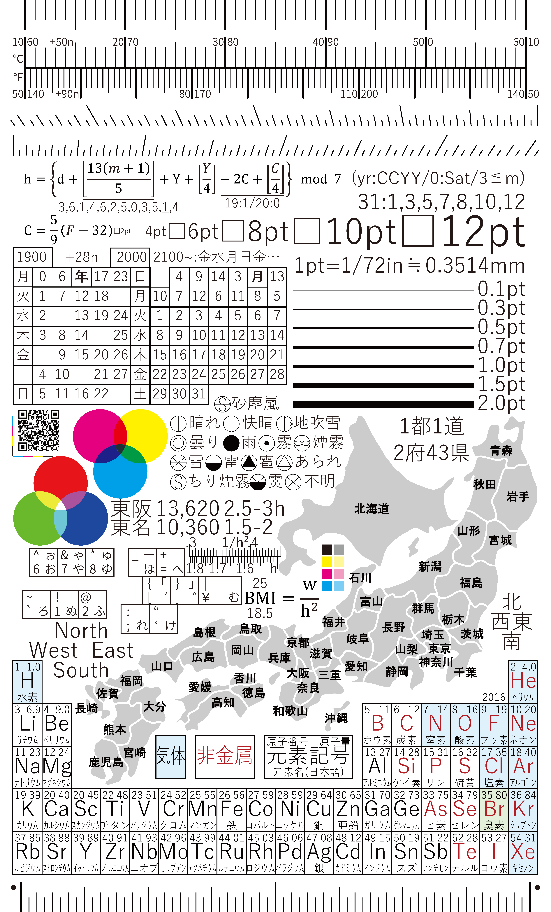
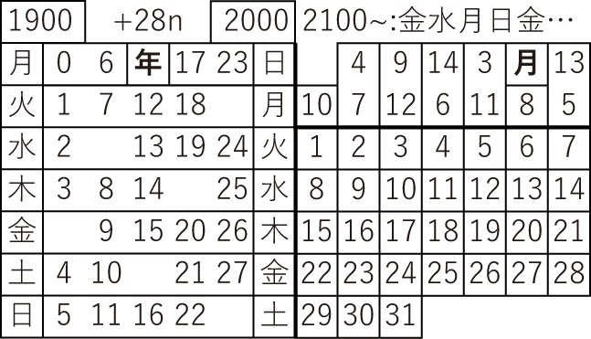
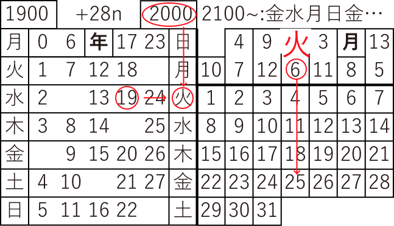
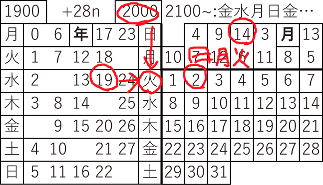
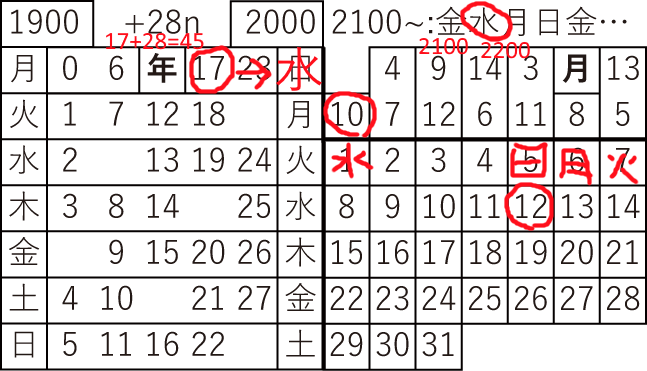
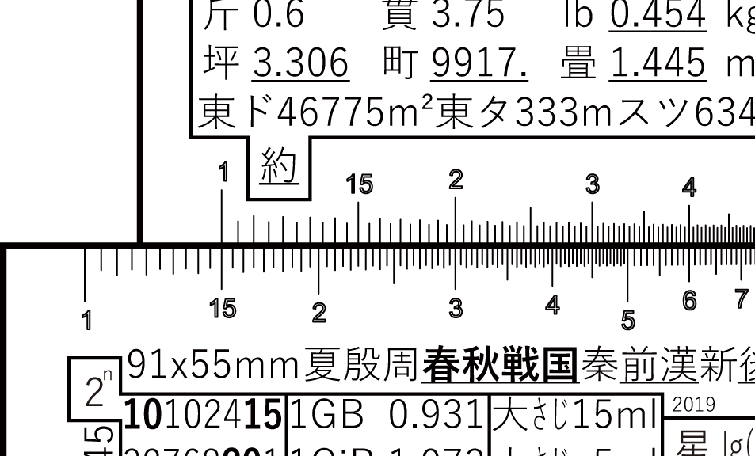

# CardSizeCheatSheet
名刺サイズでいろんなメモが書いてある手帳の付録的な奴です。

## 画像

## ダウンロード
A4厚紙用は[sheet10.pdf](sheet10.pdf)でDownloadをクリックしてください。
表面・裏面はsrcフォルダ内にあります。

## 印刷
A4厚紙かミシン目入りの10面名刺印刷シートを用意してください。
いずれも百円ショップで売っています。

1. プリンターを起動して用紙をセットします。
2. sheet10.pdfを開き両面印刷をします。
   * 印刷設定はできればカラー/きれいで。
3. 名刺サイズに切り離します。

黒の細い線を多用するのでできればレーザープリンターを使った方がきれいに印刷できると思います。
色の再現性はそれほど必要ではありません。
オフィスや大学に置いてあるプリンターは大抵カラーレーザープリンターです。

### ミシン目入りのメリット・デメリット
ミシン目入りの名刺用紙は便利ですが悪い点もあります。

ミシン目入りの良い点
* 名刺サイズにするのが簡単
* カッターナイフをミスして端が斜めになったりしない
* カッターマットを用意しなくてもいい

ミシン目入りの悪い点
* 端がギザギザになる。
   * 見た目ではほぼわかりませんが手触りで分かります。
* 印刷が若干ずれるが補正できない。
   * 厚紙を切るならかなり正確にできます。
* 余った分は名刺に使うしかない。

今回は多少の印刷ずれには対応できますが、残り(名刺90枚分程度)はまず名刺に使うしかありません。
相手にとっては端がギザギザの名刺が気になるかもしれません。
気楽な相手に名刺を渡す機会があるか面倒ならミシン目入りをお勧めします。

## ライセンス
CC0 1.0 全世界 (CC0 1.0) パブリック・ドメイン提供

著作権者表記なしで自由に使えます。
地図などの外部素材も同ライセンスまたはパブリックドメインのものを利用しています。

## コンテンツ
小さなサイズにコンテンツが盛りだくさんです。

表面
* 日本の時代区分
* 地球の時代区分・イベント
* 中国歴代王朝
* 主要国の人口・面積・順位
* 主要用紙サイズ
* 太陽系の概略データ
* 緊急電話番号
* テレビのインチ数メモ
* 主要単位換算
* 六曜
* 干支
  * 0年が太字、2000年が下線
* SI接頭辞
* 漢字文化圏の数の単位
* 日常の単位メモ
  * 大さじ・小さじ他
  * GB・GiBの誤差
* 2の累乗
* 名刺のサイズ
* 物差し
  * 5cmものさし
  * 2インチものさし
* 簡易計算尺

裏面
* 摂氏華氏換算目盛り
* 簡易分度器
* ツェラーの公式
  * グレゴリオ暦での曜日が分かる式です。
  * 計算メモ付き
* 摂氏華氏換算式
* BMI式
  * 1/h^2簡易目盛り付き
* 文字サイズ図
* 線の太さ図
* 万年カレンダー
* 加法混合・減法混合図
  * 色は目安程度に考えてください
* 日本式天気記号
* 新幹線メモ(東京・名古屋/東京・大阪間)
* 101/104キーボード使用時の記号配置
* 都道府県名地図
* 周期表
* 物差し
  * 5cmものさし
  * 2インチものさし

## 使い方
### 万年カレンダー

* 左側は年を示します。
* 右上は月を示します。
  * 1月2月は前年の13月14月だと考えます(閏年対策)。
* 2100年以降は右最上に記されています。

例えば2019年6月25日の場合、  

1. 左側で19を探します。
2. 2000年代なので右側を辿れば「火」とあるので覚えておきます。
3. 6月なので右上で6を探します。その列が「火曜日」だという事です。
4. 25日はその列にあるので「火曜日」です。

2020年2月2日の場合、  

1. 2月なので19年だと考えます。
2. 19年の行は「火」。
3. 14月の列が「火曜日」なので2日は「日曜日」です。

2245年10月12日の場合、  

1. 2100～の所を見て2200年代なので「水」、これを覚えます。
2. 45を28で割った余り、つまり17を探します(上の28nはそういう意味です)。
3. 2000年で「日」の所が「水」だとして、17の行を辿れば「水」です。覚えておきます。
4. 10月はの列が「水曜日」なので、12日は「日曜日」です。

### 計算尺
* 計算尺は掛け算と割り算ができます。
* ただしこのカードが二枚必要です。
* せいぜい一二桁までしか分からないのであまり実用的ではありません…。
* 桁数は自分で管理する必要があります。

15×20の場合
1. カードを二枚用意して計算尺の部分をくっつけます。
2. 下の15の目盛りに上の1を合わせます。
3. 上の20の部分は下の目盛りで3です。
4. 2桁×2桁かつ下側左半分で計算が済んでいるので2+2-1=3で答えは3桁、つまり300です。

300÷15の場合
1. 上の2を下の3に合わせます。
2. 上が1の目盛りの場所で下が15です。
3. 3桁÷2桁かつ下側左半分で計算が済んでいるので3-2+1=2で答えは2桁、つまり20です。